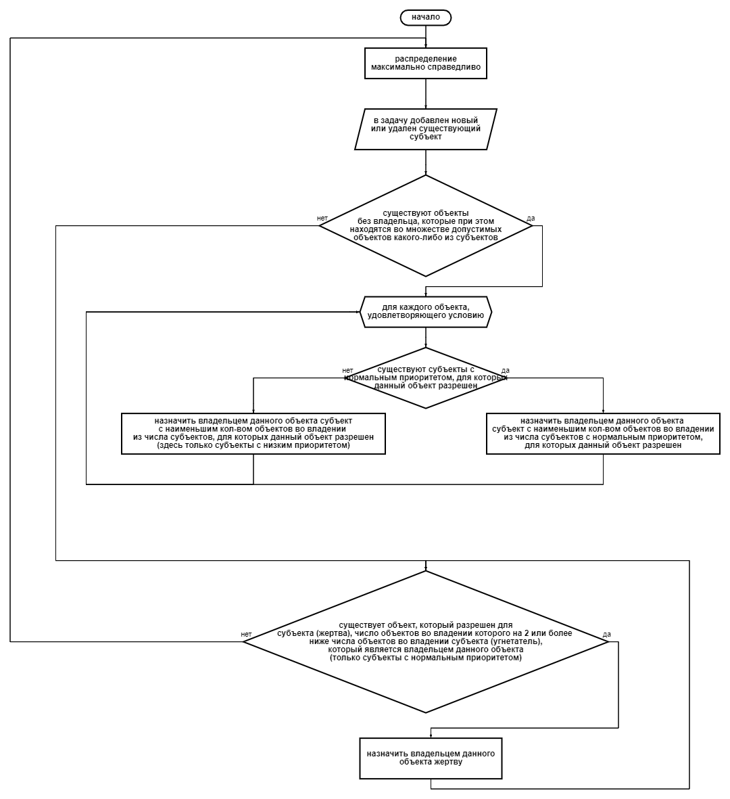

# Ownership_Distribution
<h2>О приложении</h2>

Данное приложение является реализацией решения задачи коллективного владения на языке Java.

<h2>Суть задачи</h2>

Имеется N объектов и M субъектов, M может быть как больше, равно,
так и меньше N. Каждый субъект может быть способным владеть некоторым
подмножеством из N (например N1, N2, N3) - SN. Каждый субъект в некоторый
момент времени может владеть некоторыми объектами из своего подмножества SN.
В каждый момент времени одним объектом может владеть только один субъект.
Задача заключается в том, чтобы максимально справедливо распределять владение
объектами между субъектами.

<h2>Предлагаемый алгоритм</h2>

<h2>Использованные инструменты</h2>

Сборка - Maven

Тесты - Junit 5

<h2>Запуск тестов</h2>

Тестовые классы расположены в пакете <b>src.test.java</b> 
  Команда для запуска всех тестов: <code>mvnw test</code> 
  Команда для запуска тестов из одного класса: <code>mvnw -Dtest=*имя_класса* test</code> 
  Команда для запуска одного из класса: <code>mvnw -Dtest=*имя_класса*#*имя_метода* test</code> 

Интеграционный тест для <b>предоставленного примера</b> реализован в методе <code>MainTest.ProvidedTestCase()</code> 
  Чтобы запустить его, используйте команду <code>mvnw -Dtest=MainTest#ProvidedTestCase test</code>

